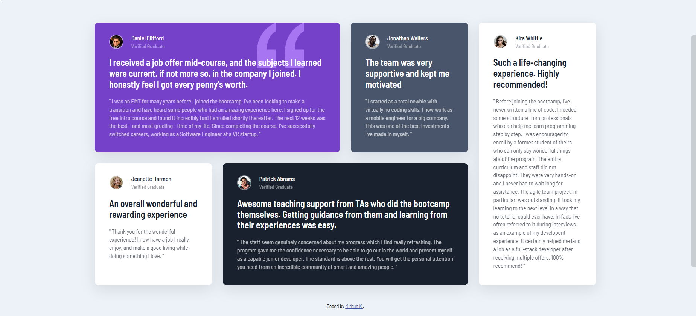
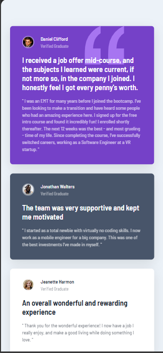

# CTI-110 Final Project - Testimonials Grid by FIRST NAME LAST NAME

## Table of contents

- [CTI-110 Final Project - Testimonials Grid by FIRST NAME LAST NAME](#cti-110-final-project---testimonials-grid-by-Mithunkarthick-Parthiban)
  - [Table of contents](#table-of-contents)
  - [Overview](#overview)
    - [The challenge](#the-challenge)
    - [Screenshot](#screenshot)
    - [Links](#links)
  - [My process](#my-process)
    - [Built with](#built-with)
    - [What I learned](#what-i-learned)
    - [Continued development](#continued-development)
    - [Useful resources](#useful-resources)
  - [Author](#author)
  - [Acknowledgments](#acknowledgments)

## Overview

### The challenge

Users should be able to:

- View the optimal layout for the interface depending on their device's screen size

### Screenshot

### Links

- Repository URL: [Github Repository](https://github.com/MKP-Winner/Parthiban-CTI-110-FinalProject)
- Live Site URL: [Actual Website](https://mkp-winner.github.io/Parthiban-CTI-110-FinalProject/)

## My process

### Built with

- Semantic HTML5 markup
- CSS custom properties
- CSS Grid for layout
- Flexbox for component alignment
- Mobile-first workflow
- Google Fonts: [Barlow Semi Condensed](https://fonts.google.com/share?selection.family=Barlow+Semi+Condensed:ital,wght@0,100;0,200;0,300;0,400;0,500;0,600;0,700;0,800;0,900;1,100;1,200;1,300;1,400;1,500;1,600;1,700;1,800;1,900) 
- Responsive design with media queries

### What I learned

Throughout this project, I strengthen my understanding of CSS Grid and how to create complex responsive layouts. The grid system allows for precise control over card placement across different screen sizes.

One key technique I implemented was using CSS Grid with media queries:
- @media (min-width: 1024px) {
    .testimonials-grid {
      grid-template-columns: repeat(4, 1fr);
    }
    .card:first-child {
      grid-column: 1 / 3;
    }
    .card-kira {
      grid-column: 4 / 5;
      grid-row: 1 / 3;
    }
  }

I also learned how to work with HSL color values from a style guide to maintain design consistency:
- .card-purple {
    background: hsl(263, 55%, 52%);
    color: white;
  }

Working with background images in CSS was another valuable skill I developed:
- .card-purple {
    background: hsl(263, 55%, 52%) url('./images/bg-pattern-quotation.svg') no-repeat top right 80px;
  }

### Continued development

In future projects, I want to continue focusing on:

- Advanced CSS Grid techniques and creating more complex layouts
- Improving accessibility features (ARIA labels, keyboard navigation)
- Adding subtle animations and transitions for better user experience
- Optimizing images for web performance
- Exploring CSS custom properties (variables) for better maintainability

### Useful resources

- [CSS Grid Generator](https://cssgridgenerator.io) - TThis interactive tool helped me visualize and generate CSS Grid layouts. It was especially useful for understanding grid-template-columns and grid positioning.
- [CSS Fonts](https://www.w3schools.com/css/css3_fonts.asp) - This guide helped me understand how to implement Google Fonts and work with font properties like font-weight and font-family.
- [CSS Flexbox](https://www.w3schools.com/css/css3_flexbox.asp) - This resource was invaluable for learning how to align items in the card headers using Flexbox properties.
- [CSS Complete Guide Grid](https://css-tricks.com/snippets/css/complete-guide-grid/) - This helped me understand CSS Grid properties and how to create responsive layouts.
- [Google Fonts Embed Code for Barlow Semi Condensed](https://fonts.google.com/specimen/Barlow+Semi+Condensed) - This resource helped me understand what to write in my css code in order to get Barlow Semi Condensed font into my website.

## Author

- Website - [Mithun's Testimonial Grid Section Website](https://mkp-winner.github.io/Parthiban-CTI-110-FinalProject/)

## Acknowledgments

I would like to thank Mr. Gardner for his support throughout CTI-110, which helped me understand the curriculum and also helped me develop a strong foundation in HTML and CSS web development. 